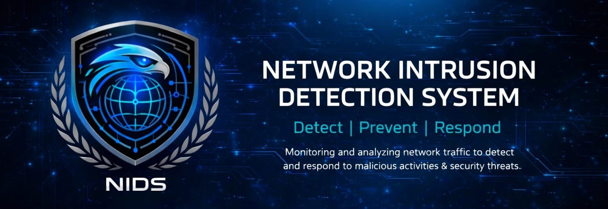

Perfect 👍
Here is an **UPDATED, PROFESSIONAL, FINAL README** for your **DeepNIDS project**, including **authentication, admin panel, theme system, models, logs, PDF export**, etc.
This is **submission + viva ready**.

---

# 🚀 DeepNIDS – Deep Learning Based Network Intrusion Detection System

## 📌 Project Overview

**DeepNIDS** is a full-stack, deep learning–based **Network Intrusion Detection System (NIDS)** that detects malicious network activities using multiple deep learning models.
The system provides a **secure web interface** with authentication, real-time predictions, logs, reports, and an admin communication panel.

---

## 🎯 Objectives

* Detect network intrusions accurately using deep learning
* Compare performance of multiple ML/DL models
* Provide a secure, interactive web-based dashboard
* Enable report generation and attack logging
* Support light/dark theme switching for better UX

---

## 🧠 Models Implemented

The system uses pre-trained deep learning models:

| Model           | Description                                               |
| --------------- | --------------------------------------------------------- |
| **DNN**         | Dense Neural Network for feature-based detection          |
| **CNN**         | Convolutional Neural Network for spatial feature learning |
| **LSTM**        | Long Short-Term Memory for sequential attack patterns     |
| **Autoencoder** | Anomaly detection using reconstruction error              |

---

## 📊 Evaluation Metrics

Each model is evaluated using:

* Accuracy
* Precision
* Recall
* F1-Score
* Confusion Matrix

📄 Evaluation reports can be **downloaded as PDF**.

---

## 🌐 Web Application Features

### 🔐 Authentication System

* User Login & Signup
* Password hashing using `werkzeug.security`
* Forgot & Reset Password
* Session-based access control

---

### 🏠 Dashboard

* Model selection & prediction
* Real-time confidence score
* Attack/Normal classification
* Interactive UI

---

### 📈 Model Comparison

* Side-by-side comparison of all models
* Accuracy, Precision, Recall, F1-score displayed visually

---

### 📜 Logs & Reports

* Stores prediction logs in SQLite database
* Export logs as:

  * CSV
  * PDF
* Timestamped attack history

---

### 🛠 Admin Panel

* View user messages (Contact form)
* Real-time message count (AJAX)
* Mark messages as Read
* Delete messages
* Admin-only access control

---

### 🎨 Theme System

* Light & Dark mode support
* Theme persists using `localStorage`
* Logo dynamically changes with theme
* Theme applied across all pages (Login, Dashboard, Admin)

---

## 🗂 Project Structure

```
NIDS-Project/
│
├── app/
│   ├── app.py
│   ├── database.db
│
├── models/
│   ├── deepnids_dnn.h5
│   ├── deepnids_cnn.h5
│   ├── deepnids_lstm.h5
│   └── deepnids_autoencoder.h5
│
├── data/
│   └── processed/
│       ├── X.npy
│       └── y.npy
│
├── static/
│   ├── css/
│   ├── js/
│   └── images/
│
├── templates/
│   ├── login.html
│   ├── signup.html
│   ├── home.html
│   ├── models.html
│   ├── compare.html
│   ├── logs.html
│   ├── admin_messages.html
│   └── contact.html
│
├── reports/
│   └── *.pdf
│
└── README.md
```

---

## 🛠 Technologies Used

### Backend

* Python
* Flask
* SQLite
* TensorFlow / Keras
* Scikit-learn
* ReportLab (PDF generation)

### Frontend

* HTML5
* CSS3 (Light/Dark Mode)
* JavaScript (AJAX)
* Responsive UI Design

---

## ⚙️ Installation & Setup

### 1️⃣ Install Dependencies

```bash
pip install flask tensorflow scikit-learn numpy pandas reportlab
```

### 2️⃣ Run Application

```bash
python app.py
```

### 3️⃣ Open Browser

```
http://127.0.0.1:5000
```

---

## 🔐 Default Admin Access

```
Username: admin
Password: admin123   (or as defined in DB)
```

---
## Output


---

## 📌 Key Highlights (For Viva)

* Multi-model deep learning approach
* Secure authentication with hashed passwords
* AJAX-based real-time updates
* PDF/CSV report generation
* Theme persistence across sessions
* Modular & scalable architecture

---

## 🎓 Viva One-Line Explanation

> “DeepNIDS is a deep learning–based intrusion detection system that combines multiple neural network models with a secure, interactive web interface for real-time attack detection and analysis.”

---

## 🚀 Future Enhancements

* Real-time packet capture
* Live attack visualization charts
* Email alerts for detected intrusions
* Role-based access control
* Cloud deployment

---

## 👨‍💻 Developed By

**DeepNIDS Team**
Department of Computer / AI / Cyber Security

---

## 📜 License

This project is intended for **educational and academic purposes only**.